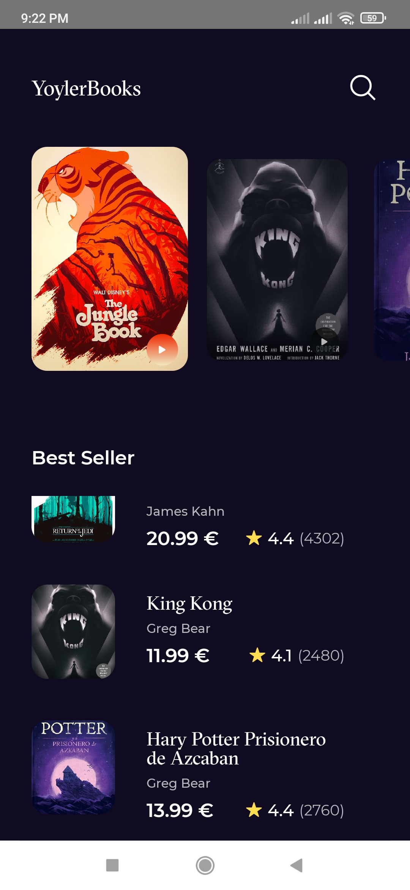
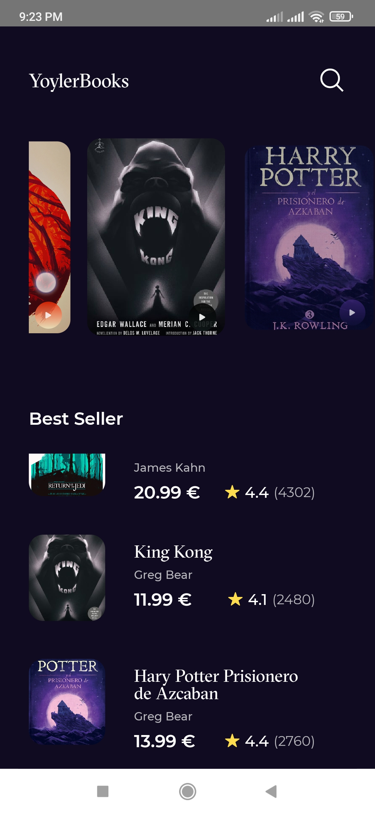
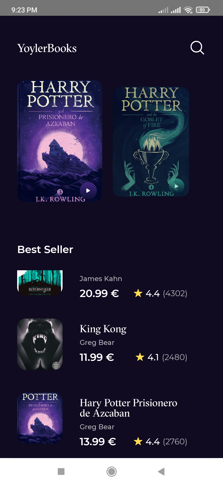
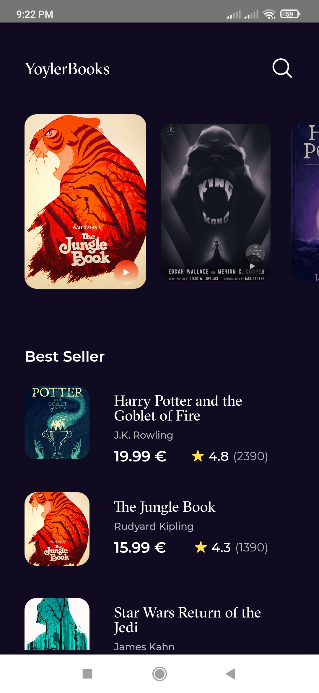
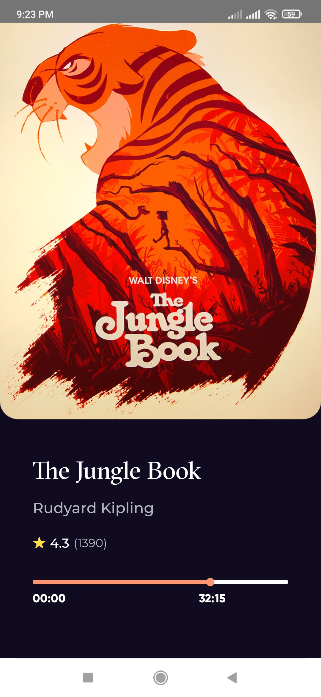
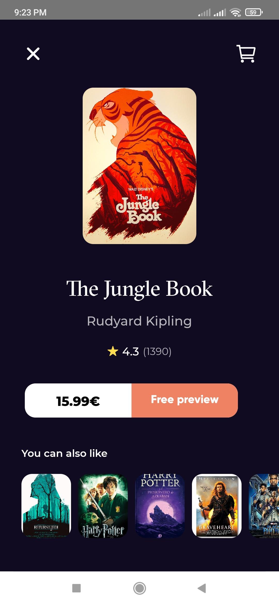
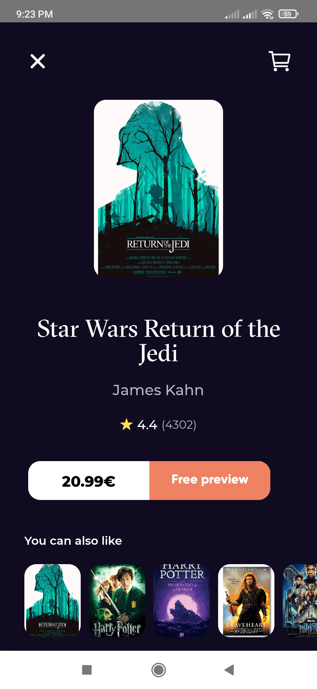
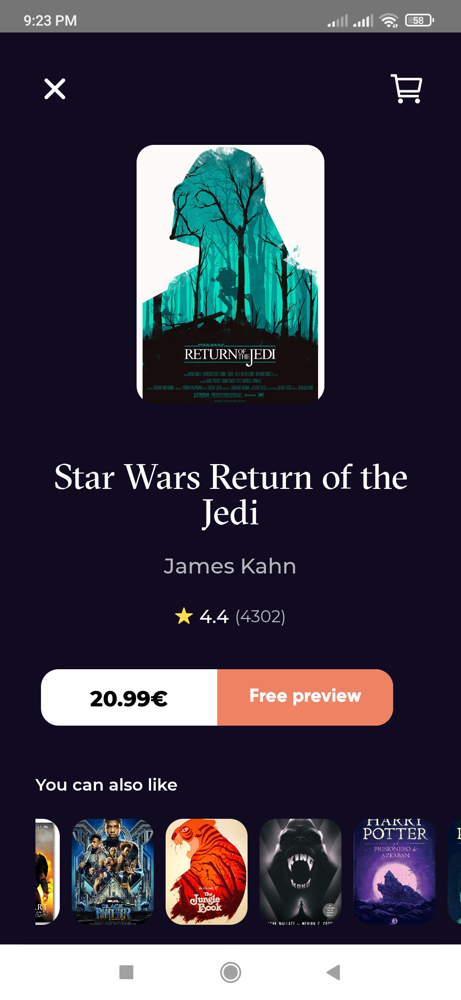

# EbookApp

## EbookApp  App Concept

In this application the design of an EbookApp is replicated using React Native. _[Desing](https://dribbble.com/shots/10682895-FREE-Ebooks-APP)_
**This application is strictly visual, mock data was used.**

### Tools used
* TypeScript
*   React native CLI
*	React Navegation
*  React native vector icons
* React native carusel
* React native linear gradient
* React native Image colors
* Custom Fonts

### Result:

Image | Image
-------- | -------
 | 
 | 
 | 
 | 
 | 

[**Yoyler Cordoba**](https://twitter.com/yoiler_cordoba)
